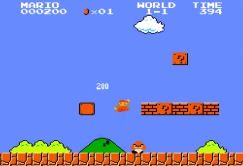

# MarioRL
Teaching AI to Play Super Mario Using Reinforcement Learning (Double Deep Q Learning Algorithm)!



1. Set up a Mario environment
2. Preprocess the game for applied AI
3. Train the model to play Mario
4. Test it out

### How to Run:

**Clone this repository**
```bash
git clone git@github.com:mobinajamali/MarioRL.git
```

**Install PyTorch**
[PyTorch's website](https://pytorch.org/).


**Install the rest of the requirements**

```bash
pip install -r requirements.txt
```